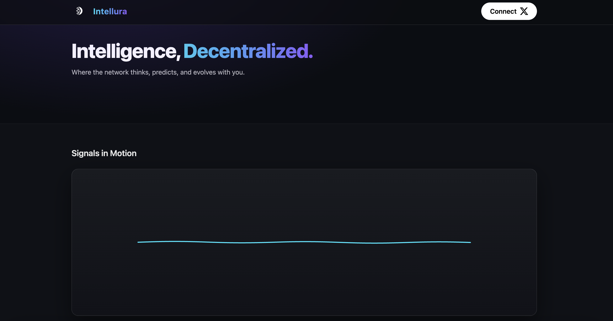
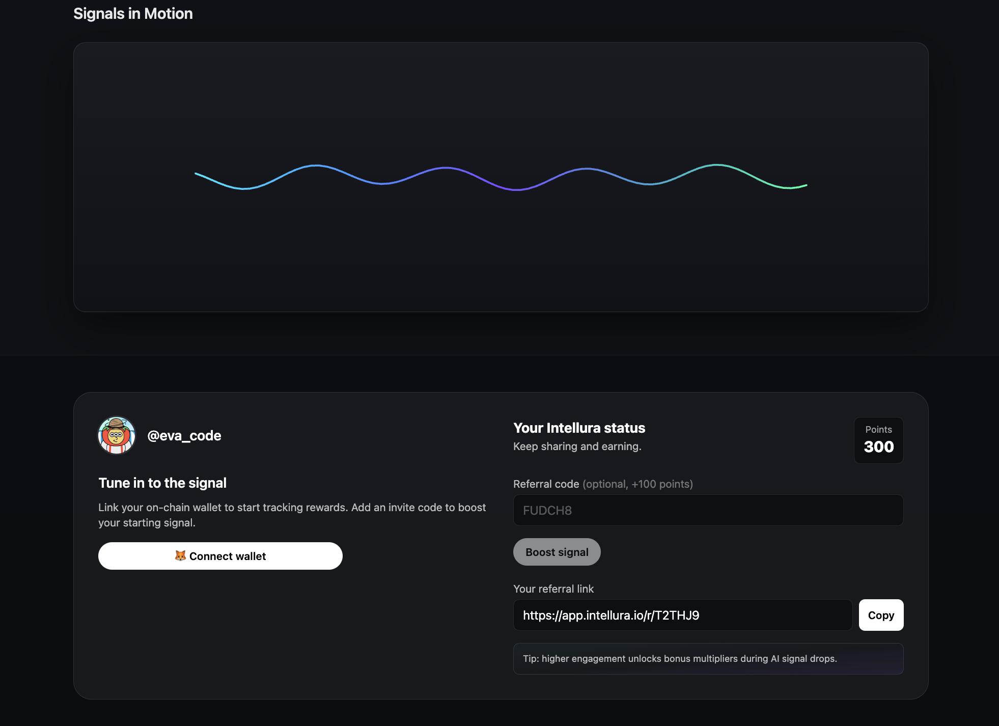
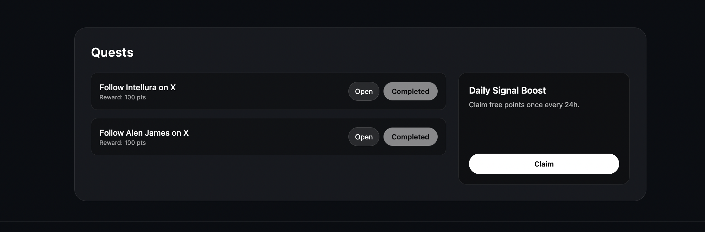

# Intellura — AI DePIN Network (Stage 1: Signal Campaign)

Intellura is an **AI-powered DePIN network** where users and nodes generate, validate, and learn from live **signals** (social + market + on-chain).  
This repository contains the **first product stage – Signal Campaign**: a public web app that attracts users to the network with quests, referrals, and daily engagement.

---

## 🔭 What’s in this repo (Stage 1)

- **Signal Campaign UI** for onboarding and growth
- **Quests & Points** (follow, share, complete actions)
- **Referrals & Daily Boosts**
- **Signals in Motion** (live network signal animation)
- **Wallet connect** (for on-chain identity & rewards)

> Later stages (prediction markets, node integrations, AI model feedback loops) live in private/internal repos.

---

## 🖼 Product Screens (this build)

### 1) Landing — “Intellura First”
A simple first-touch experience that introduces **Signals in Motion** and invites users to connect.

  

### 2) Signal Broadcast
Users see their **referral link**, optional **invite code**, **current points**, and the animated **signal line**.  
Encourages sharing/broadcasting to grow the network.

  

### 3) Missions (Quests)
Actionable quests (e.g., “Follow on X”) with **Open / Completed** states and a **Daily Signal Boost** claim.

  

> If your filenames differ, update the paths above. From your note:  
> - `IntelluraFirst.png`  
> - `SignalBroadcast.png`  
> - `PointMissions.png`  

---

## 🧠 Why Intellura (high-level)

- **AI + Crowd Intelligence**: Aggregate user predictions & social signals to improve market forecasts.  
- **DePIN Utilization**: Turn unused bandwidth/compute into useful inference/training work tied to incentives.  
- **Better Accuracy**: Blend human sentiment + network data to reduce forecast error over time.

---

## ⚙️ Tech Stack

- **Frontend:** React + Type Script + Vite, TailwindCSS
- **Backend:** FastAPI (Python) 
- **Database:** PostgreSQL
- **Realtime / Auth:** (varies by deployment)
- **AI Layer:** LLM-powered insights & signal aggregation (internal services)

